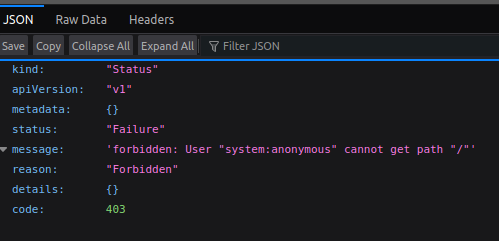

- [Kubenetes (minikube) hosted Spark](#kubenetes-minikube-hosted-spark)
  - [Install minikube](#install-minikube)
  - [Basics](#basics)
      - [Kubectl Configuration](#kubectl-configuration)
      - [What Port](#what-port)
      - [Sidecars, Ambassadors and Multiple Service-Pod Patterns](#sidecars-ambassadors-and-multiple-service-pod-patterns)
  - [Preparations](#preparations)
      - [Must have dns configured.](#must-have-dns-configured)
      - [Does docker have enough room?](#does-docker-have-enough-room)
      - [Set CPU and Memory](#set-cpu-and-memory)
      - [Check kubernetes client library alignment](#check-kubernetes-client-library-alignment)
    - [Starting Minikube](#starting-minikube)
  - [Spark Setup on Kb8s](#spark-setup-on-kb8s)
    - [Building Spark Image](#building-spark-image)
    - [Loading the Image to mini-kube](#loading-the-image-to-mini-kube)
    - [Spark service account](#spark-service-account)
      - [Kubectl (opt. A)](#kubectl-opt-a)
      - [Kube config (opt. B)](#kube-config-opt-b)
  - [Running A Compute Job](#running-a-compute-job)
    - [Running the in-built example](#running-the-in-built-example)
    - [Checking the logs](#checking-the-logs)
  - [Future Investigations](#future-investigations)
  - [References](#references)


# Kubenetes (minikube) hosted Spark


## Install minikube

Follow the following link to get your first cluster started: 

* https://minikube.sigs.k8s.io/docs/start/?arch=%2Flinux%2Fx86-64%2Fstable%2Fbinary+download

## Basics

#### Kubectl Configuration

You can check active configuration with:

```bash
kubectl config get-contexts
```

If you have multiple configurations, you can switch the ambient context with:

```bash
kubectl config set-context  minikube
```

replace `minikube` above with your context of choice

To view your `kubectl` configurations run:

```bash
cat ~/.kube/config | less
```

#### What Port

There are 3 major types of "ports" in kube config:

* nodePort: Port exposed externally
* port: The service port (a service is scaled across pods)
* targetPort: The port on the actual pod itself (the smallest deployable unit - collection of images)


#### Sidecars, Ambassadors and Multiple Service-Pod Patterns

* [Sidecar](https://kubernetes.io/docs/concepts/workloads/pods/sidecar-containers/#pod-sidecar-containers): a special case of `initContainer` that can be used to on a shared volume to clean up logs, or do other clean up work, not chronologically tied to the main service.
* Ambassador: A service to do some of the proxying but not the load balancing as that is still best left to the ingress controller. However an ambassador can manage things like retry, timeout policies, validate tokens, etc. Think AOP with REST.
* Multiple Services/Pod: Not recommended due to scalability issue and the liveliness/readiness probe that may not be able to ascertain the status of each container [see](https://www.reddit.com/r/kubernetes/comments/12cdxm1/is_it_a_bad_idea_to_run_a_pod_that_contain/) discussion on reddit.

## Preparations

#### Must have dns configured.

Locally this means running the following commands. (minikube 1.33)

```bash
minikube addons enable ingress-dns
minikube addons list # should show up w/ a green checkmark
```

#### Does docker have enough room?

Docker may be in a smaller partition than home in a local laptop, if so ensure that it has enough space. This **[article](https://medium.com/code-uncomplicated/moving-dockers-storage-location-6804c3f8b0ea#:~:text=is%20most%20appropriate.-,Docker's%20Default%20Storage%20Location,docker%20directory%20on%20Linux%20systems.)** shows you how to do that. But at a high level:

1. Stop docker
2. Edit system.d docker service
3. Move the files out of the traditional `var/lib/docker`  
4. Restart the serrvice

*NOTE* if you use encryption like ecryptfs, the overlay folder can't be used as docker root directory.

#### Set CPU and Memory

```bash
minikube config set memory 16384
minikube config set cpus 4
```

Alternatively if cluster is already running

```bash
kubectl edit deployments.apps coredns -n kube-system
```

#### Check kubernetes client library alignment

https://github.com/fabric8io/kubernetes-client


### Starting Minikube

```bash
minikube start
minikube status
```

Minikube uses docker to host kubernetes, you can check this via.

```bash
docker ps
```

Checking the status on kubectl (you must have this installed)

```bash
kubectl cluster-info context-info
```

To which you should get something like:


> Kubernetes control plane is running at https://192.168.49.2:8443
CoreDNS is running at https://192.168.49.2:8443/api/v1/namespaces/kube-system/services/kube-dns:dns/proxy
To further debug and diagnose cluster problems, use 'kubectl cluster-info dump'.

But wait, if you try to access the control plane you will get a 403. This [is expected](https://stackoverflow.com/questions/53052625/how-do-i-see-a-list-of-all-minikube-clusters-running-in-docker-on-my-mac).



So you need to run

```bash
kubectl proxy
```

## Spark Setup on Kb8s

[Download](https://medium.com/@SaphE/deploying-apache-spark-on-a-local-kubernetes-cluster-a-comprehensive-guide-d4a59c6b1204) Spark 

Untar the archive:

```bash
tar -xzvf spark-3.4.3-bin-hadoop3.tgz
```

### Building Spark Image 

Go to the extracted folder and run the docker build.

In the following command self-hosted-kb8 is the image tag name and "build" is the command.

Note: We have chosen arbitrarily that the tag for the image is `self-hosted-kb8`

```bash
./bin/docker-image-tool.sh -t self-hosted-kb8 build
```

To confirm that the image was created enter

```bash
docker images
```

### Loading the Image to mini-kube

```bash
minikube image load spark:self-hosted-kb8
```

### Spark service account

Service account are accounts that are used to identify services in kb8s

In this documentation we want to create a service account named `spark` and it will have the default `edit` role.

The `edit` role grants the account permissions to create, update, and delete core resources like deployments, services, and configmaps

There are two options to this using:

#### Kubectl (opt. A)

```bash
kubectl create serviceaccount spark
kubectl create clusterrolebinding spark-role --clusterrole=edit --serviceaccount=default:spark --namespace=default
```

#### Kube config (opt. B)

You can give the yamls any arbitrary names 

```yaml
apiVersion: v1
kind: ServiceAccount
metadata:
  name: spark
  namespace: default
```

```yaml
apiVersion: rbac.authorization.k8s.io/v1
kind: ClusterRoleBinding
metadata:
  name: spark-role
roleRef:
  apiGroup: rbac.authorization.k8s.io
  kind: ClusterRole
  name: edit
subjects:
- kind: ServiceAccount
  name: spark
  namespace: default
```

cd to where the yamls are and you can apply them all with

```bash
kubectl apply -f .
```

## Running A Compute Job

**IMPORTANT** An obvious difference from typical kb8s web apis/micro service cluster is that you do not manage your cluster directly using `kubectl` instead the job is initialized and managed using `spark-submit` which brokers the cluster and app deployment for you.

**NOTE** the container name

**NOTE** The `http` and the kube proxy address (see: Starting Minikube)

**NOTE** When this article was written, spark 3.4.3 was used, and this is reflected in the jar file

**NOTE** The the path to the jar is a path in the container

You can explore the spark image by running, and then using the standard `ls`

```
docker run --name my-spark-exp -it spark:self-hosted-kb8 bash
```
### Running the in-built example
```bash
spark-submit --master k8s://http://127.0.0.1:8001 --deploy-mode cluster --name spark-pi --class org.apache.spark.examples.SparkPi --conf spark.executor.instances=2 --conf spark.kubernetes.container.image=spark:self-hosted-kb8 --conf spark.kubernetes.container.image.pullPolicy=IfNotPresent --conf spark.kubernetes.authenticate.driver.serviceAccountName=spark local:///opt/spark/examples/jars/spark-examples_2.12-3.4.3.jar 100
```

### Checking the logs

When your job runs (or didn't run) it will print the pod information where the driver is running

>State changed, new state:                                                                                                                                                                  
         pod name: spark-pi-2-f4b6529154d2c2ea-driver                                                                                                                                                                                          
         namespace: default                                                                                                                                                                                                                    
         labels: spark-app-selector -> spark-e9024ae36db5415e9a1d41e560f9f5b4, spark-role -> driver                                                                                                                                            
         pod uid: 7f75d95a-2226-4794-8685-8a56448613cc                                                                                                                                                                                         
         creation time: 2024-08-15T06:56:26Z                                                                                                                                                                                                   
         service account name: spark                                                                                                                                                                                                           
         volumes: spark-local-dir-1, spark-conf-volume-driver, kube-api-access-qxq68                                                                                                                                                           
         node name: minikube                                                                                                                                                                                                                   
         start time: 2024-08-15T06:56:26Z                                                                                                                                                                                                      
         phase: Pendin

Copy the pod name to check the logs:

```bash
kubectl logs spark-pi-2-f4b6529154d2c2ea-driver
```

## Future Investigations

* How to run history server
* How to forward port 4040 on spark submit
* How to submit wheel vs jar
* How to mount volume and run a wheel and dated located in it
* Repeating the experiment in the cloud


## References

Spark on local cluster [https://medium.com/@SaphE/deploying-apache-spark-on-a-local-kubernetes-cluster-a-comprehensive-guide-d4a59c6b1204]
